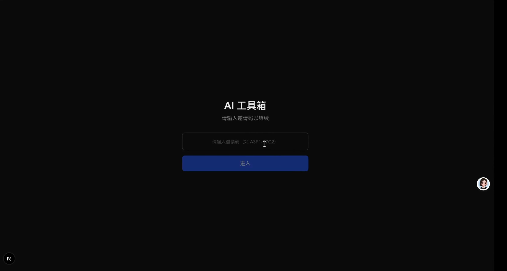

# AI Toolbox

> [**English README**](README.en.md)

一款基于 Web 的 AI 辅助内容处理工具箱，支持音频转写、知识库管理、文档解析等功能。

基于 [Next.js](https://nextjs.org) 16 (App Router)、React 19、Tailwind CSS 4、TypeScript 构建。

---


> 点击图片看录屏或者点击[**Demo.mp4**](/public/demo.mp4)跳转到录屏文件

[](https://nos.netease.com/youdata-netease/public-utilUpload-hJtV4EjNY14TgV3zkHT2fj.mp4)

## 功能特性

### 🎙️ 音频转写
- 通过阿里云 DashScope ASR 接口对音频文件进行语音识别
- 支持常见音频格式（MP3、WAV、M4A 等）
- 配合阿里云 OSS 临时存储音频文件
- 支持从 B站、小宇宙等平台下载音频后转写
- 转写完成后自动调用 AI 生成结构化 Markdown 笔记 + Mermaid 思维导图，一键保存

### 📓 Obsidian 同步
- AI 生成的 Markdown 笔记和思维导图支持**一键保存到本地 Obsidian 仓库**
- 文件自动存入 Obsidian 的「音视频笔记」文件夹，与你的笔记体系无缝融合
- 长期使用可形成**个人知识图谱**——每次处理的内容都会沉淀到 Obsidian 中，不断积累、串联、复用
- 仅需配置本地 Obsidian 仓库路径即可使用

### 🧠 知识库
- 基于向量嵌入的文档语义搜索
- 文档自动分块（chunking）与向量化
- 支持多类型文档导入（PDF、Word、Markdown、HTML、CSV）
- 支持通过 URL 抓取网页内容
- 支持飞书文档解析（需配置飞书应用凭证）
- 使用 SQLite 本地存储，无需额外数据库

### 📄 文档解析
- **PDF** — 提取文本内容
- **Word (.docx)** — 提取文本和基本格式
- **Markdown / HTML** — 完整内容提取
- **飞书文档** — 解析飞书知识库和多维表格
- **CSV** — 表格数据导入

### 🤖 LLM 集成
- 支持 **Anthropic Claude**（通过 Anthropic SDK）
- 支持 **DashScope 通义千问**（Qwen 系列模型）
- 用于内容生成、摘要、问答等任务

### ⚡ 异步任务流水线
- 所有耗时操作均通过异步任务执行
- 实时进度推送（Server-Sent Events）
- 支持任务取消和错误重试

### 📊 内容生成与可视化
- 音频/视频转录后自动生成**结构化 Markdown 笔记**（含摘要、要点提炼、关键引述）
- 自动生成 **Mermaid 思维导图**，将视频/播客内容以知识图谱形式可视化呈现
- 支持生成 **XMind 文件**，可在 XMind 桌面端打开编辑
- **Mermaid** 图表渲染（流程图、时序图等）


---

## 环境要求

| 依赖 | 说明 | 安装方式 |
|------|------|----------|
| Node.js 20+ | 运行环境 | [nodejs.org](https://nodejs.org) |
| npm | 包管理 | 随 Node.js 安装 |
| yt-dlp | 音频下载（可选） | `brew install yt-dlp` |
| ffmpeg | 音频处理（可选） | `brew install ffmpeg` |

## 快速开始

### 1. 安装依赖

```bash
# 安装系统依赖（macOS 需要音频下载功能时）
brew install yt-dlp ffmpeg

# 验证系统依赖
npm run check

# 安装项目依赖
npm install
```

### 2. 配置环境变量

```bash
cp .env.example .env.local
```

编辑 `.env.local`，填入你的 API 密钥：

| 变量 | 必填 | 说明 |
|------|------|------|
| `DASHSCOPE_API_KEY` | ✅ | 阿里云 DashScope API 密钥（用于语音识别 + 通义千问 LLM + 向量嵌入） |
| `OSS_REGION` | ⚠️ | 阿里云 OSS 地域，如 `oss-cn-beijing`（音频转写功能需要） |
| `OSS_ACCESS_KEY_ID` | ⚠️ | 阿里云 OSS Access Key |
| `OSS_ACCESS_KEY_SECRET` | ⚠️ | 阿里云 OSS Access Secret |
| `OSS_BUCKET` | ⚠️ | OSS 存储空间名称 |
| `ANTHROPIC_API_KEY` | 可选 | Anthropic API 密钥（使用 Claude 模型时需要） |
| `FEISHU_APP_ID` | 可选 | 飞书应用 App ID（解析飞书文档时需要） |
| `FEISHU_APP_SECRET` | 可选 | 飞书应用 App Secret |
| `INVITE_CODE` | 可选 | 登录邀请码（不设置则首次启动时自动生成 10 个随机码，见终端日志） |

> **注意**：最小配置只需 `DASHSCOPE_API_KEY` 即可使用 LLM 和知识库功能。音频转写需要额外配置 OSS。

### 3. 启动开发服务器

```bash
npm run dev
```

打开浏览器访问 [http://localhost:3000](http://localhost:3000)。

### 4. 生产构建

```bash
npm run build
npm start
```

---

## 使用指南

### 音频转写与内容生成

1. 导航到 **Audio** 页面
2. 上传音频文件，或粘贴 B站 / 小宇宙等平台的视频/音频链接
3. 系统会自动下载（如需要）并转写音频
4. 转写完成后，AI 自动生成结构化 Markdown 笔记和 Mermaid 思维导图
5. 在任务列表中可查看生成的笔记和导图预览

### 保存到 Obsidian

1. 首次使用前，在设置页面配置你的 Obsidian 仓库路径（或通过 `.env.local` 中的 `OBSIDIAN_VAULT_PATH` 配置）
2. 任意任务处理完成后，在任务列表点击 **Obsidian** 按钮
3. 生成的 Markdown 笔记和思维导图将自动保存到你的 Obsidian 仓库中
4. 长期积累，你的 Obsidian 将形成一个不断生长的**个人知识图谱**

### 知识库

1. 导航到 **Knowledge Base** 页面
2. 点击 **添加文档**，支持：
   - 上传文件（PDF、Word、Markdown、CSV）
   - 输入网页 URL 抓取内容
   - 输入飞书文档链接
3. 文档导入后自动分块和向量化
4. 在查询面板输入问题，系统会基于语义搜索返回最相关的内容

### LLM 对话

知识库的 RAG 查询会自动使用配置的 LLM 生成回答。支持 Claude 和 Qwen 两种模型后端，在 `.env.local` 中通过 `LLM_PROVIDER` 切换。

---

## 项目结构

```
src/
├── app/                    # Next.js App Router 页面和 API 路由
│   ├── api/                # 后端 API 接口
│   │   ├── auth/           # 登录认证
│   │   ├── kb/             # 知识库 CRUD 和查询
│   │   ├── tasks/          # 任务管理
│   │   ├── submit/         # 提交处理
│   │   ├── progress/       # 进度推送（SSE）
│   │   └── ...
│   ├── audio/              # 音频转写页面
│   ├── kb/                 # 知识库页面
│   ├── history/            # 历史记录页面
│   └── login/              # 登录页面
├── components/             # React 组件
│   ├── kb/                 # 知识库相关组件
│   └── ...                 # 通用组件
├── lib/                    # 核心逻辑
│   ├── asr/                # 语音识别
│   ├── downloader/         # 音频下载（B站、小宇宙）
│   ├── generator/          # 内容生成（Markdown、Mermaid、XMind）
│   ├── kb/                 # 知识库（解析、分块、嵌入、存储、RAG）
│   │   ├── parsers/        # 各类文档解析器
│   │   ├── store.ts        # SQLite 存储层
│   │   ├── embedding.ts    # 向量嵌入
│   │   └── rag.ts          # 检索增强生成
│   ├── llm/                # LLM 调用封装
│   ├── pipeline.ts         # 任务流水线
│   └── taskStore.ts        # 任务状态管理
└── types/                  # TypeScript 类型定义
```

## 技术栈

| 技术 | 用途 |
|------|------|
| [Next.js](https://nextjs.org) 16 | 框架（App Router） |
| [React](https://react.dev) 19 | UI 库 |
| [Tailwind CSS](https://tailwindcss.com) 4 | 样式 |
| [Lightning CSS](https://lightningcss.dev) | CSS 处理 |
| [SQLite](https://github.com/WiseLibs/better-sqlite3) | 嵌入式数据库 |
| [Anthropic SDK](https://github.com/anthropics/anthropic-sdk-typescript) | Claude API |
| [DashScope](https://help.aliyun.com/product/dashscope) | 通义千问 API、语音识别、向量嵌入 |
| [ali-oss](https://github.com/ali-sdk/ali-oss) | 阿里云 OSS 存储 |
| [pdf-parse](https://github.com/nickacosta/pdf-parse) | PDF 解析 |
| [mammoth](https://github.com/mwilliamson/mammoth.js) | Word 文档解析 |
| [cheerio](https://github.com/cheeriojs/cheerio) | HTML 解析 |
| [react-markdown](https://github.com/remarkjs/react-markdown) | Markdown 渲染 |

## 许可证

[MIT](LICENSE)
